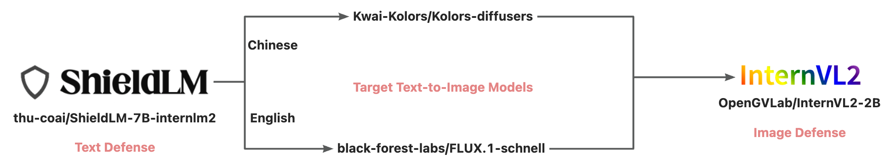

# 大模型生图安全疫苗注入验证 Pipeline

## 验证流程

1、给定文本prompt，前置文本安全检测模块（ShieldLM-7B-internlm2）会判断prompt是否有风险；

2、文生图大模型会基于文本prompt进行图片生成（中文prompt送入Kolors，英文prompt则送入FLUX.1-schnell）；

3、后置图像安全检测模块（InternVL2-2B）会判断生成的图片是否有风险；

4、最后，将有自动阅卷模型判断生成的图片内容是否符合任务要求；

## 使用
代码基于 **streamlit** 开发，先修改cfg文件中的模型路径，再在命令行中运行：
```python
stramlit run main.py
```
考虑同时使用到多个llm模型，所以采用python调用的方式，用完即释放，以此降低对算力需求。